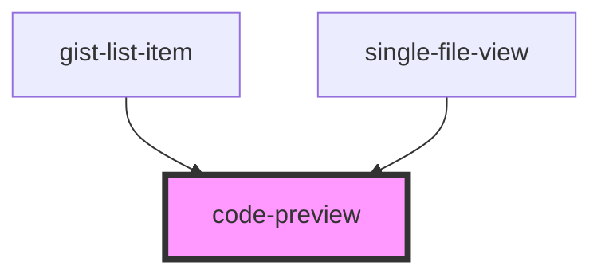

# code-preview

<!-- Auto Generated Below -->

## Properties

| Property   | Attribute   | Description | Type       | Default     |
| ---------- | ----------- | ----------- | ---------- | ----------- |
| `code`     | --          |             | `string[]` | `undefined` |
| `codeLang` | `code-lang` |             | `string`   | `undefined` |

## Dependencies

### Used by

 - [gist-list-item](../gist-list-item)
 - [single-file-view](../single-file-view)

### Graph

----------------------------------------------

*Built with [StencilJS](https://stenciljs.com/)*
