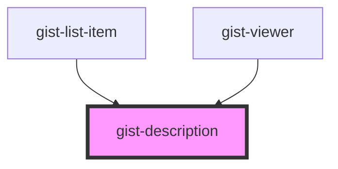

# gist-description

<!-- Auto Generated Below -->

## Overview

A component shows given gist description

## Properties

| Property      | Attribute     | Description | Type     | Default     |
| ------------- | ------------- | ----------- | -------- | ----------- |
| `description` | `description` |             | `string` | `undefined` |

## Dependencies

### Used by

 - [gist-list-item](../gist-list-item)
 - [gist-viewer](../gist-viewer)

### Graph

----------------------------------------------

*Built with [StencilJS](https://stenciljs.com/)*
