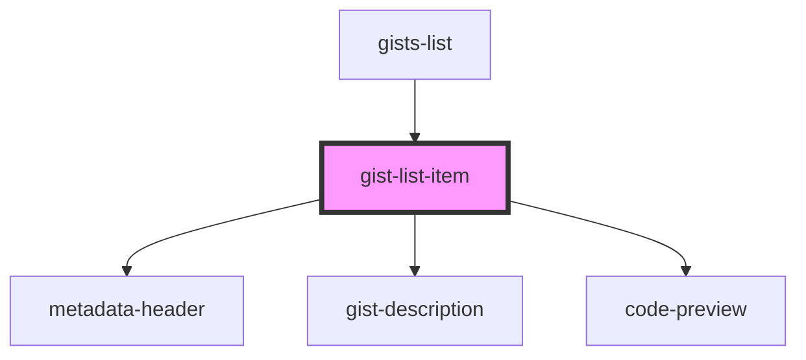

# gist-list-item

<!-- Auto Generated Below -->

## Overview

A component that shows metadata, description and code preview
of a given gist via the appropriate child components

## Properties

| Property       | Attribute | Description | Type        | Default     |
| -------------- | --------- | ----------- | ----------- | ----------- |
| `gistListItem` | --        |             | `IGistItem` | `undefined` |

## Events

| Event      | Description | Type                  |
| ---------- | ----------- | --------------------- |
| `goToGist` |             | `CustomEvent<string>` |

## Dependencies

### Used by

 - [gists-list](../gists-list)

### Depends on

- [metadata-header](../metadata-header)
- [gist-description](../gist-description)
- [code-preview](../code-preview)

### Graph

----------------------------------------------

*Built with [StencilJS](https://stenciljs.com/)*
