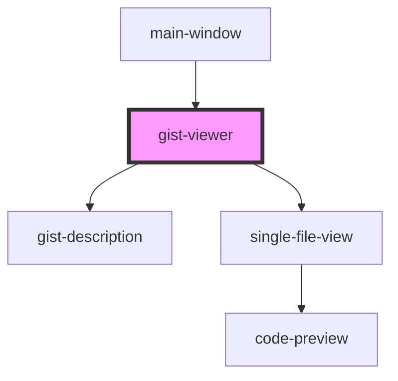

# gist-viewer

<!-- Auto Generated Below -->

## Overview

A component shows single gist with all files in it and descriotion
Also this component intercepts gist ID to event when user choose a file
form gist

## Properties

| Property     | Attribute | Description | Type        | Default     |
| ------------ | --------- | ----------- | ----------- | ----------- |
| `singleGist` | --        |             | `IGistItem` | `undefined` |

## Dependencies

### Used by

 - [main-window](../main-window)

### Depends on

- [gist-description](../gist-description)
- [single-file-view](../single-file-view)

### Graph

----------------------------------------------

*Built with [StencilJS](https://stenciljs.com/)*
