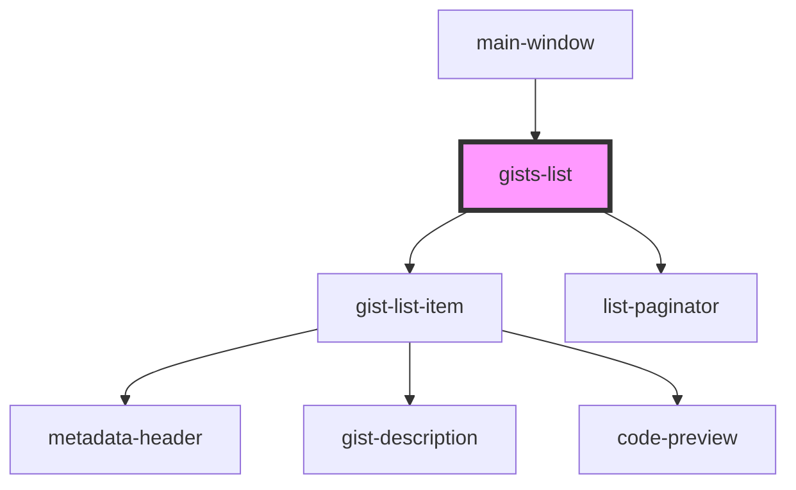

# gists-list

<!-- Auto Generated Below -->

## Overview

A component shows list of given gists and paginator

## Properties

| Property      | Attribute      | Description | Type          | Default     |
| ------------- | -------------- | ----------- | ------------- | ----------- |
| `currentPage` | `current-page` |             | `number`      | `undefined` |
| `gistsList`   | --             |             | `IGistItem[]` | `undefined` |
| `lastPage`    | `last-page`    |             | `boolean`     | `undefined` |

## Dependencies

### Used by

 - [main-window](../main-window)

### Depends on

- [gist-list-item](../gist-list-item)
- [list-paginator](../list-paginator)

### Graph

----------------------------------------------

*Built with [StencilJS](https://stenciljs.com/)*
