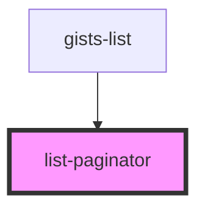

# list-paginator

<!-- Auto Generated Below -->

## Properties

| Property      | Attribute      | Description | Type      | Default     |
| ------------- | -------------- | ----------- | --------- | ----------- |
| `currentPage` | `current-page` |             | `number`  | `undefined` |
| `lastPage`    | `last-page`    |             | `boolean` | `undefined` |

## Events

| Event      | Description | Type                  |
| ---------- | ----------- | --------------------- |
| `goToPage` |             | `CustomEvent<number>` |

## Dependencies

### Used by

 - [gists-list](../gists-list)

### Graph

----------------------------------------------

*Built with [StencilJS](https://stenciljs.com/)*
