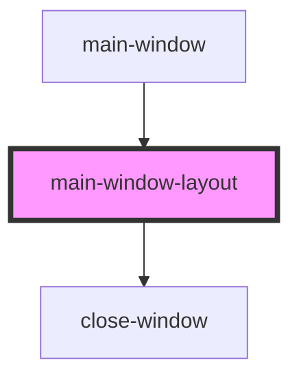

# main-window-layout

<!-- Auto Generated Below -->

## Overview

A small component that returns just a main window layout skeleton

## Dependencies

### Used by

 - [main-window](.)

### Depends on

- [close-window](.)

### Graph

----------------------------------------------

*Built with [StencilJS](https://stenciljs.com/)*
