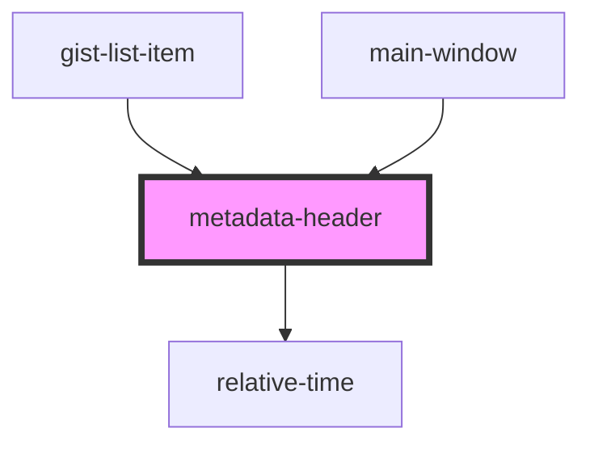

# metadata-header

<!-- Auto Generated Below -->

## Overview

A component shows given metadata of gist

## Properties

| Property       | Attribute | Description | Type            | Default     |
| -------------- | --------- | ----------- | --------------- | ----------- |
| `gistMetadata` | --        |             | `IGistMetadata` | `undefined` |
| `userData`     | --        |             | `IUserData`     | `undefined` |

## Events

| Event           | Description | Type                  |
| --------------- | ----------- | --------------------- |
| `goToGist`      |             | `CustomEvent<string>` |
| `goToUserGists` |             | `CustomEvent<string>` |

## Dependencies

### Used by

 - [gist-list-item](../gist-list-item)
 - [main-window](../main-window)

### Depends on

- [relative-time](../relative-time)

### Graph

----------------------------------------------

*Built with [StencilJS](https://stenciljs.com/)*
