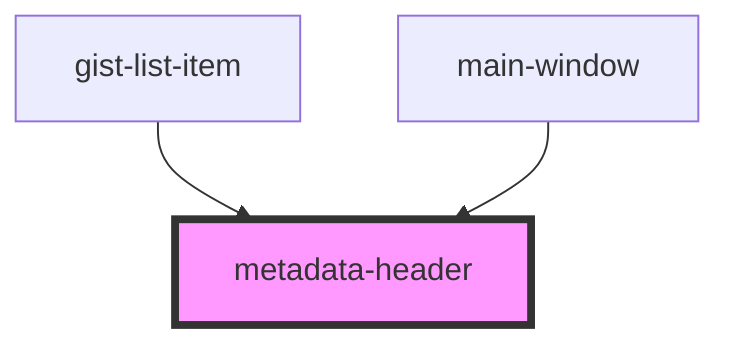

# metadata-header

<!-- Auto Generated Below -->

## Overview

A component shows given metadata of gist

## Properties

| Property       | Attribute | Description            | Type            | Default     |
| -------------- | --------- | ---------------------- | --------------- | ----------- |
| `gistMetadata` | --        | Gist metadata          | `IGistMetadata` | `undefined` |
| `userData`     | --        | A data of gist's owner | `IUserData`     | `undefined` |

## Events

| Event           | Description                                   | Type                  |
| --------------- | --------------------------------------------- | --------------------- |
| `goToGist`      | Emits gist ID that user choosed               | `CustomEvent<string>` |
| `goToUserGists` | emits login of gist's owner that user ckicked | `CustomEvent<string>` |

## Dependencies

### Used by

 - [gist-list-item](../gist-list-item)
 - [main-window](../main-window)

### Graph

----------------------------------------------

*Built with [StencilJS](https://stenciljs.com/)*
