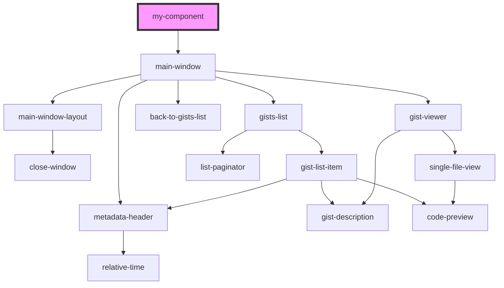

# my-component

<!-- Auto Generated Below -->

## Dependencies

### Depends on

- [main-window](../main-window)

### Graph

----------------------------------------------

*Built with [StencilJS](https://stenciljs.com/)*
