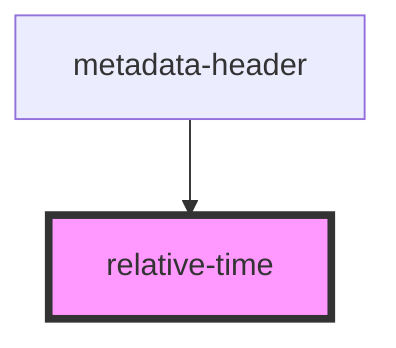

# relative-time

<!-- Auto Generated Below -->

## Overview

A component shows relative time by given timestamp in Date format

## Properties

| Property                 | Attribute | Description | Type   | Default     |
| ------------------------ | --------- | ----------- | ------ | ----------- |
| `timestamp` _(required)_ | --        |             | `Date` | `undefined` |

## Dependencies

### Used by

 - [metadata-header](../metadata-header)

### Graph

----------------------------------------------

*Built with [StencilJS](https://stenciljs.com/)*
