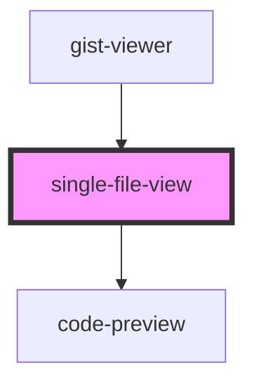

# single-file-view

<!-- Auto Generated Below -->

## Overview

A component shows single file in a gist and emits this file data by click

## Properties

| Property   | Attribute   | Description | Type       | Default     |
| ---------- | ----------- | ----------- | ---------- | ----------- |
| `code`     | --          |             | `string[]` | `undefined` |
| `codeLang` | `code-lang` |             | `string`   | `undefined` |
| `filename` | `filename`  |             | `string`   | `undefined` |

## Events

| Event              | Description                                   | Type                           |
| ------------------ | --------------------------------------------- | ------------------------------ |
| `selectFileInsert` | Emits gist file data object that user clicked | `CustomEvent<IGistFileInsert>` |

## Dependencies

### Used by

 - [gist-viewer](../gist-viewer)

### Depends on

- [code-preview](../code-preview)

### Graph

----------------------------------------------

*Built with [StencilJS](https://stenciljs.com/)*
